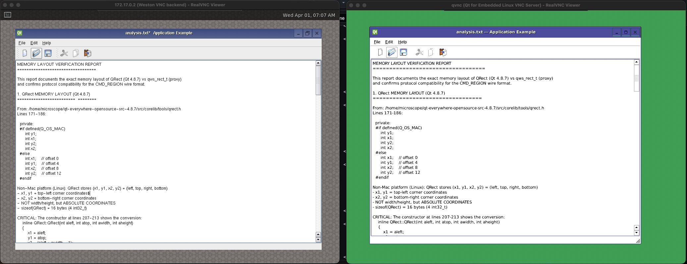
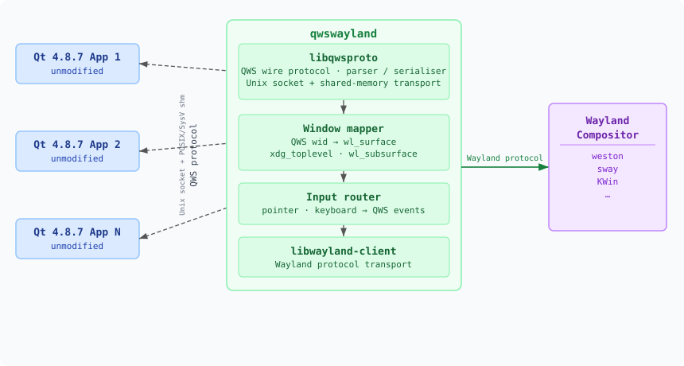

# QWSWayland - QWS to Wayland Protocol Proxy

A bridge that allows legacy Qt 4.8.7/QWS (Qt Window System) applications to
run unmodified under a Wayland compositor - analogous to how XWayland enables
legacy X11 applications on Wayland, but (so far) without resorting to direct integration into a compositor itself.

## Status

**Testing and extending - functional on example application in the current configuration** 

- Moving and resizing support (at least for top-level windows with QWSManager)
- Keyboard input including special keys and key repetition
- Pointer support including standard buttons and scrolling
- Pixel buffer support currently fixed to *ARGB32* on server and client
- Limited font database creation and handling, i.e. currently QPF fonts — see
[Font Database](#font-database).
- Identifies the primary screen with the VNC screen driver for now — see [Screen Driver](#screen-driver)

The following screenshot shows the example app with QWSWayland using Weston as compositor in comparison
to a "native" QWS server using the VNC screen driver. The only visible difference is the application not being able to use its preferred font due to the font database also being
generated by QWSWayland and therefore limited to QPF fonts only as explained above.



> The bad color scheme is likely the result of some specific Qt flags or other configuration causing a
> low color depth and is not meant to be viewed for comparing the quality - it was just enough for building
> a Qt example application, so that comparing the behavior and tracing is possible without spending 
> too much effort into getting all of Qt to build. 

> In general build Qt 4.8.7 on a recent gcc 14.2.0 in Debian trixie on ARM64 was already annoying enough, but
> pre-compiled Qt4 builds in common distribution usually do not include the embedded platform support,
> so QWS is not available. Reusing existing binaries without feature headers is also something that
> I never ever want to try again, so a minimal build of Qt 4.8.7 was likely the easiest choice. See also 
> [below](#building-qt-487-only-if-you-should-really-really-need-to).

## Architecture



Each Qt 4.8.7 application connects to the proxy over a Unix socket using the
QWS wire protocol, exchanging commands and events backed by POSIX or SysV
shared memory. The proxy translates those into Wayland operations and routes
compositor input events back to the appropriate client.

## Components

### `libqwsproto/`
Re-implementation of the QWS wire protocol without Qt dependency.

Provides parsing and serialisation of QWS commands (client→server) and
events (server→client), plus the Unix socket and shared-memory transport
layer (both SysV and POSIX IPC backends).

>The QWS wire protocol has some rough edges regarding its serialization depending on the compiler and/or the architecture - e.g. C bit fields have been used and there is no specific consideration for word-alignment.
>
>This fact may cause issues on other architectures (tested only on ARM64 so far) and might require specific adjustment depending on the Qt build that shall be interfaced with - e.g. if client blittering has been enabled in the Qt build using a header definition, it needs to be enabled in libqwsproto as well.
>
>However, this still is worth the trouble as it removes very old Qt source code dependency which may become suddenly quite fragile in modern compilers (those who know know and I am now unfortunately one of them - let me just say: `QT_NO_FOREACH` makes a lot of sense now - keep reading if you want to know more).
>
>Therefore, this decision may cause some additional pain at a later stage, but also saves a lot of headache during the entire development process. And in any case, trying to bind against the compiled binary versions or statically linked applications would likely be no joke either. 
>
>I hope that the maximal extent of modification to an executable at some point might be using something like `LD_PRELOAD` to affect some higher-level changes.

### `proxy/`
The QWSWayland proxy daemon. Listens for QWS client connections and:

- Maps each QWS window to a `wl_surface` with an `xdg_toplevel` (top-level
  windows) or a `wl_subsurface` (child windows).
- Copies pixel data from the QWS client's shared-memory buffer into a
  `wl_shm`-backed `wl_buffer` and commits it to the compositor.
- Routes Wayland input events (`wl_pointer`, `wl_keyboard`) back to the
  appropriate QWS client as QWS events.
- Uses `zxdg_output_manager_v1` / `zxdg_output_v1` to track the logical
  output geometry reported by the compositor.

### `trace_proxy/`
A man-in-the-middle proxy that sits between a QWS client and a real QWS server,
forwarding all traffic verbatim while decoding and logging the protocol for diagnostics.

```bash
qws_trace_proxy -l 1 -u 0 -v brief   # listen on :1, upstream :0
myapp -display ':1'                   # point the client at the proxy
```

Verbosity levels: `off`, `basic`, `brief`, `fields`, `hexdump`. Packet types can be
filtered with `-i`/`-x`. Use `-P file.pcapng` to write a pcapng capture readable in
Wireshark with the included [QWS dissector](wireshark/qws_dissector.lua). Reference
captures for typical interactions are in [`wireshark/`](wireshark/).

See [launch.json](.vscode/launch.json) or [tasks.json](.vscode/tasks.json) for examples.

## Building

```bash
mkdir builddir && meson setup builddir && meson compile -C builddir
```

**Dependencies:** `libwayland-client`, `libxkbcommon`, `wayland-protocols`,
`wayland-scanner`, `libicu` (icu-uc), `pixman-1`,
`libpcap` (optional — enables QWS UNIX socket packet dumping support in libqwsproto), `pkg-config`

**Cross-compiling:** `cross/arm-openipc-linux-gnueabi.ini` targets ARM 32-bit (OpenIPC).
The example application is excluded automatically from cross builds. Use
`-Dbuild_proxy=false` to build only the trace proxy for deployment on a target running a
native QWS server (no Wayland dependencies needed). Use `-Dipc_backend=posix` if the
target Qt build uses POSIX IPC.

```bash
# trace proxy only, for a native QWS target:
meson setup builddir --cross-file cross/arm-openipc-linux-gnueabi.ini -Dbuild_proxy=false
# full project (Wayland stack must be in sysroot):
meson setup builddir --cross-file cross/arm-openipc-linux-gnueabi.ini
```

## Usage

```bash
./qwswayland  # it can be as simple as this, yes
```

Qt 4.8.7 applications should then be launched with `-qws`. The default display id is `0` as before,
but can be reconfigured in QWSWayland using command line options. 

The `QWS_DISPLAY` environment variable on the client needs to be set to same display if a non-default 
display is used. Alternatively, QWS applications typically also provide a `-display` command line 
option.

Again see [launch.json](.vscode/launch.json) or [tasks.json](.vscode/tasks.json) for examples.

## Screen Driver

QWSWayland currently only directs QWS clients to use the VNC screen driver for the primary screen.
In practice, any (or at least the common ones) Qt screen driver should work — the client only 
queries basic information from it and does not depend on it for rendering (there is no actual 
type of VNC connection involved between QWSWayland and a QWS client).

The `linuxfb` driver would be the primary screen driver to focus on, but unfortunately requires
a Linux framebuffer device to be present, as the client attempts to open it directly. Since 
the VNC screen driver can be built into Qt with minimal extra effort and Qt needed to be build anyways,
it is the pragmatic choice for now.

Unfortunately, that's the somewhat annoying thing about screen drives in QWS: clients might want direct 
hardware to the screen rather than delegating everything to the server — comparable to how Qt 6's Wayland
integration also tends toward direct paths at first, though the latter provides fallback options by
default (although someone could explain that in the not-so-helpful "error" message there).

## Font Database

In practice, it would be possible to keep using the font database created by a native QWS server. For now,
however, QWSWayland's proxy aggressively deletes the existing Qt temp directories for the given display to
prevent silently reusing existing display state. It then recreates the simplest version of the font database
using the QPF fonts found in the local Qt installation.

> This aggressive deletion comes from the fact that I did not even notice for days that the display SHM lock
> creation was still missing and the font cache was actually required to be created by the server, since
> this had been quietly taken care of by the native QWS server during one of the testing/tracing runs before 
> QWSWayland was even in a state to do anything meaningful... If the font cache has been created, it is
> apparently just kept around as long as the temp files are not cleaned up.Therefore, at least for now it is
> aggressively deleted, but that could be easily changed.

## Building Qt 4.8.7 (only if you should really really need to)

The source code archive for Qt 4.8.7 can still be obtained directly from Qt 
[here](https://download.qt.io/archive/qt/4.8/4.8.7/qt-everywhere-opensource-src-4.8.7.tar.gz). There
are also multiple other Github mirrors available - and apparently even a Qt 4 branch in Qt's official
Github repository, but in doubt the source archive is likely the safest bet to get the final official release
of the Qt 4.8 branch.

Unfortunately, as also hinted at above, building it on a recent gcc 14.2.0 in Debian trixie on ARM64 proves
somewhat challenging. The build seems to be running rather smoothly at first, but then there is an 
unexplained flood of missing attributes in source files generated by `uic4` from `.ui` definition files (e.g. basically all dialogs like QFileDialog and so on).

After quite some debugging, it became evident that the issue is in the expansion of the `QT_FOREACH` macro
that hides itself all over the source code as another less conspicuous macro `foreach`. More specifically:
`QT_FOREACH`'s magic template-ish implementation was broken in a way that effectively turned it into 
something that should rather be called `QT_FOR_AT_MOST_ONCE`, since that's exactly all it did.

This then caused `uic4` not to iterate over all XML attributes in a `.ui` file and therefore it did not 
generate the attributes with the specified names - as expected by the rest of the source code - but
with some default names based on the type name and a running count.

I did not find a specific reference for this behavior, but it makes so much sense that we still today
see `QT_NO_FOREACH` defines being used out of a force of habit - and likely caution - also in recent Qt 
source code, since this can get rather ugly really fast without much evidence pointing at the concrete
underlying issue. 


As `QT_FOREACH` seems to have been created due to varying support for iterators in archaic C++ versions
(and maybe even used in C at some point - I have no idea and do not really want to know), this offered
a very hackish, quite ugly yet shockingly simple fix for the macro with a recent C++ compiler:

```cpp
#define Q_FOREACH(variable, container) for (variable: container)
```

> **To be clear**: 
> It might not really have been related to the GCC version and could also be related to 
> the default C++ standard selected or even the ARM64 architecture, since I do not remember running
> into similar issues on a previous ARM32 build, but the configure script maybe also chose different
> options for cross-compilation - however, the compiler was also likely older...
> I did not investigate further and was just glad when it finally worked and did not blow up in an 
> even bigger issue.

The macro works basically everywhere except for a few minor places in examples where people chose to define 
iterator variables outside the `foreach` statement or even tried to reuse them in multiple statements...
That was obviously not something that the simple macro could handle on its own.

This [patch](./qt487-gcc14.2.0-debian-trixie.patch) now fixes the `Q_FOREACH` define and all errors
in the examples that I did encounter during building as described above.

The build configuration itself was generated using a hack-ish attempt to disable everything that can 
be disabled without getting into the specifics of every option (*and yes, dear reader, it took me longer
to work out some issues than it would have taken me to type all options by hand - I think we all 
knew that was going to happen xD*)
```bash
./configure -opensource -embedded $(./configure --help | grep -- ' -no-' | sed -E 's/^\s*\*?\s*([^ .]*).*/\1/g' | grep -ivE 'gui|sql|stl|sse|neon|exceptions|xmlpatterns|largefile|qt3') -platform linux-g++ -debug -qt-gfx-vnc -confirm-license
```

In case somebody is wondering, this expanded to the following configure command for me:

```bash
./configure -opensource -embedded -no-fast -no-system-proxies -no-accessibility -no-multimedia -no-audio-backend -no-phonon -no-phonon-backend -no-svg -no-webkit -no-javascript-jit -no-script -no-scripttools -no-declarative -no-declarative-debug -no-mmx -no-3dnow -no-avx -no-libtiff -no-libmng -no-openssl -no-rpath -no-optimized-qmake -no-nis -no-cups -no-iconv -no-pch -no-dbus -no-separate-debug-info -no-gtkstyle -no-nas-sound -no-opengl -no-openvg -no-sm -no-xshape -no-xvideo -no-xsync -no-xinerama -no-xcursor -no-xfixes -no-xrandr -no-xrender -no-mitshm -no-fontconfig -no-xinput -no-xkb -no-glib -platform linux-g++ -debug -qt-gfx-vnc -confirm-license
```

The rest of the build process goes exactly as it should after applying the patch mentioned above.

## Acknowledgement / Warning

AI tooling has been used in this project - specifically:

* **Claude Chat** - to create a rough first draft of the implementation to judge how complex the protocol is in the first place and see how far it will get on its own. This unfortunately led to some quite annoying discoveries later on when Claude hallucinated some protocol/Qt-level structures that could have been specified the way it thought, but just hadn't been. That caught me very much off-guard as I am not familiar with Qt development at all.
* **Claude Code** - to take over active development with assistance, but this is better for control and worse for abstraction unfortunately - although it could have been due at least partially to lack of clear guidance on my part. And the fact that I have not tried planning mode yet... That really brings some
of the best of both worlds :-O

In general, the goal is to review AI-generated code as well as possible while hopefully refining the "AI rules of engagement" to prevent redundant, overly complicated or simply massively overblown AI code in general. Otherwise, this quickly seems to overwhelm Claude. And this makes me personally also a bit more comfortable.